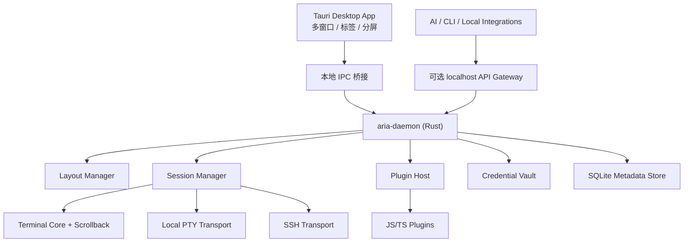

# Aria Terminal 架构规格草案 v0.1

- 状态：Draft
- 日期：2026-04-01
- 目标读者：项目实现者、插件作者、后续 AI 集成开发者

## 1. 愿景

Aria Terminal 是一个以 Windows 为主、同时支持 macOS 和 Linux 桌面的现代终端模拟器。它不把“窗口”和“终端进程”绑定死，而是采用“单一后台管理服务 + 多前端视图”的架构：

- 所有本地 PTY、SSH 会话、窗口布局、插件和 AI 接口都由一个 Rust 后台守护进程统一管理。
- Tauri 桌面前端只是 UI Shell，可以开多个窗口、多标签和多分屏，并附着到任意会话。
- AI 或其他本地工具可以通过统一 API 读取终端内容、订阅变化、写入输入，甚至在权限允许时执行更高层的自动化操作。

这个架构的核心目标不是“做一个只是能显示字符的终端”，而是做一个“可编排的终端平台”。

## 2. 目标与非目标

### 2.1 产品目标

1. 提供现代、可主题化、可自定义字体与配色的桌面终端体验。
2. 启动迅速、渲染流畅，支持鼠标、复制粘贴、快捷键、分屏、多窗口等高级特性。
3. 使用单一后端服务统一管理所有终端会话，并对外提供适合 AI 消费的 API。
4. 原生支持本地终端和 SSH 终端，并提供连接配置管理与安全凭据存储。
5. 从一开始就为插件化设计，让第三方用 JavaScript/TypeScript 编写扩展成为一等能力。

### 2.2 非目标

1. 首个版本不追求移动端支持。
2. 首个版本不强求图形协议支持完整覆盖（如 sixel、kitty graphics）；架构需要预留扩展点。
3. 首个版本不做多人协作共享终端；API 和权限模型应为未来保留空间。

## 3. 关键设计决策

| 主题 | 决策 | 原因 |
| --- | --- | --- |
| 后端形态 | 采用单实例、按用户运行的 Rust daemon | 满足“所有终端统一可见、可编排、可被 AI 访问” |
| 前后端职责 | 后端维护终端权威状态，前端只负责呈现与交互 | 多窗口/多观察者一致性更强，AI API 更自然 |
| 本地终端 | 通过 PTY 抽象层统一 Windows/macOS/Linux | 便于跨平台与后续替换实现 |
| SSH | 将 SSH shell 也抽象成一种终端 transport | 本地与远程统一成同一 Session 模型 |
| API | 内部 IPC + 可选 localhost 网关，共用同一 RPC 模型 | 既适合 UI，也适合外部 AI/自动化 |
| 插件 | 采用能力声明式的 JS/TS 插件系统 | 易写、易分发、易做权限隔离 |
| 渲染 | 前端自定义终端渲染器，后端输出结构化 diff/snapshot | 性能和可观测性更平衡 |
| Pretext 的角色 | 用于 UI 文本布局、字体度量、终端字体标定，不承担 VT 核心解析 | 贴合 pretext 擅长的高性能文本测量/排版能力 |

## 4. 总体架构



### 4.1 进程划分

系统分成三个可执行单元：

1. `aria-daemon`
   负责 PTY、SSH、终端状态、布局、插件、API、凭据协调，是系统唯一的权威后端。
2. `aria-desktop`
   Tauri 桌面应用，负责窗口、前端渲染、设置页、连接管理页、插件 UI 容器。
3. `aria-cli`
   可选工具，用于调试 daemon、发 token、检查会话、脚本化接入。

### 4.2 生命周期

- 桌面应用启动时先尝试连接 daemon。
- 若 daemon 不存在，则以当前用户身份拉起 daemon。
- daemon 在没有窗口时不必立即退出；只要仍存在活跃会话、SSH 连接或被显式设置为驻留，就继续运行。
- 当前端全部关闭但 daemon 仍存活时，终端会话可继续保持。

这满足“前端视图”和“会话生命周期”解耦。

## 5. 领域模型

### 5.1 核心实体

| 实体 | 说明 |
| --- | --- |
| `Session` | 一个可交互终端实例，来源可以是本地 PTY 或 SSH shell |
| `Transport` | 向 `Session` 提供字节流的抽象，支持 `LocalPtyTransport` 和 `SshTransport` |
| `Viewer` | 一个附着到 `Session` 的可视观察者，通常对应某个 pane |
| `Window` | 前端顶层窗口 |
| `Tab` | 一个窗口中的标签页容器 |
| `Pane` | 标签页中的分屏节点，绑定一个 `Viewer` |
| `ConnectionProfile` | SSH 或本地启动模板配置 |
| `CredentialRef` | 指向安全存储中某条秘密材料的引用 |
| `Plugin` | 一个安装后的扩展单元，具有 manifest、权限和运行时入口 |

### 5.2 Session 与 Pane 解耦

这是整个架构最重要的模型约束：

- `Pane` 不是终端本体，它只是一个“视图”。
- `Session` 可以被一个或多个 `Pane` 附着。
- 一个 `Pane` 重新绑定到另一个 `Session` 时，不会迁移旧 Session，只是切换观察对象。

好处：

1. 可以实现“同一终端在两个窗口同时观察”。
2. AI、插件和 UI 都能引用同一个 `session_id`。
3. 窗口销毁不会天然导致会话销毁。

## 6. 后端模块设计

### 6.1 Daemon Core

职责：

- 启动各服务模块
- 管理配置、日志、数据库和事件总线
- 监听本地 IPC 与可选 localhost 网关
- 做统一认证、授权和审计

建议技术：

- `tokio` 作为主异步运行时
- `tracing` + `tracing-subscriber` 作为日志与诊断基础
- `sqlx` 或 `rusqlite` + SQLite 作为元数据存储

### 6.2 Session Manager

职责：

- 创建、销毁、恢复 `Session`
- 维护 `session_id -> actor` 注册表
- 管理 `Viewer` 订阅
- 路由输入、resize、鼠标事件
- 维护 session 元信息：标题、cwd、shell、连接来源、活动状态

建议实现：

- 每个 `Session` 由一个 actor/task 管理
- actor 内部持有：
  - 一个 `Transport`
  - 一个 `Terminal Core`
  - 一个 scrollback buffer
  - 一个 subscriber 列表
  - 一个 optional semantic tracker（用于 AI 友好的命令块/提示符边界）

### 6.3 Transport 抽象层

统一 trait：

```rust
trait Transport {
    async fn write(&mut self, data: &[u8]) -> Result<()>;
    async fn resize(&mut self, cols: u16, rows: u16, pixel_width: u16, pixel_height: u16) -> Result<()>;
    async fn shutdown(&mut self) -> Result<()>;
    fn metadata(&self) -> TransportMetadata;
}
```

具体实现：

1. `LocalPtyTransport`
   使用跨平台 PTY 抽象层创建 shell / command，并接入 stdout/stderr 字节流。
2. `SshTransport`
   建立 SSH 连接，申请远程 PTY，打开 shell channel，并转成同样的字节流语义。

这保证本地和 SSH 会话在 `Session` 层是同构的。

### 6.4 Terminal Core

职责：

- 解析 VT/ANSI 控制序列
- 维护屏幕状态、cursor、attributes、alternate screen
- 维护 scrollback 和快照
- 产出结构化 diff，推送给前端和 AI API

建议设计：

- 抽象 `TerminalEngine` trait，避免未来被某个 parser 实现锁死。
- v1 优先采用现成 Rust terminal parser 实现，而不是手写 parser。
- v1 的目标是稳定支持 shell、TUI、鼠标事件和常见 xterm/DEC 语义。
- 图形协议、sixel、inline image 作为后续扩展能力，而不是 v1 阻塞项。

建议初始策略：

- 先用成熟 crate 完成 v1 验证
- 在 Aria 代码中额外抽象出自己的 buffer/snapshot 结构
- 不让前端依赖具体 parser crate 的内部数据结构

### 6.5 Scrollback 与 Snapshot Store

原则：

- 终端权威状态在后端
- 前端只保留渲染需要的视口缓存
- AI 查询默认走后端 snapshot/search API

建议：

- 内存中维护 ring buffer scrollback，默认 50k 到 200k 行，可配置
- 最近快照增量缓存，便于新 viewer 快速附着
- 可选持久化录制由单独模块提供，不成为主路径强依赖

### 6.6 SSH Manager

职责：

- 管理 SSH 连接配置、known hosts、host key 校验策略
- 支持 password、public key、agent、passphrase 等认证方式
- 为 `SshTransport` 提供连接工厂

要求：

- 支持连接复用策略，但不要求 v1 完成连接池
- 连接配置和凭据分离存储
- host key 初次连接时必须显式确认或按策略校验

### 6.7 Credential Vault

职责：

- 保存密码、token、passphrase 等小型 secret
- 保存导入型私钥或其解密所需材料

建议策略：

1. 小型 secret 直接存放到系统密钥库。
2. 导入的私钥不直接明文写入 SQLite。
3. 若需要“应用托管私钥”，则用“随机主密钥加密私钥文件”，而主密钥再由系统密钥库保护。

这能兼顾跨平台一致性和安全性。

### 6.8 Layout Manager

职责：

- 存储窗口、标签、分屏树
- 跟踪哪个 pane 连接哪个 session
- 支持拖拽标签页到新窗口
- 支持前端断连后恢复布局

建议：

- 布局状态由 daemon 保存，前端只提交变更意图
- 使用树结构描述 pane split
- layout 与 session 分离存储

### 6.9 Plugin Host

职责：

- 发现、加载、启停插件
- 校验 manifest、能力声明和版本兼容性
- 给插件暴露受控 API
- 隔离插件崩溃影响范围

v1 设计选择：

- 插件开发语言：JavaScript / TypeScript
- 分发格式：文件夹或压缩包，包含 manifest 和编译后的 ESM
- 后端插件运行时：嵌入式 JS 引擎（建议 `rquickjs` 路线）
- 前端插件 UI：运行在前端插件宿主容器中，通过 host API 与 daemon 通信

说明：

- 不要求 v1 具备 Node.js 全兼容 API。
- 插件 API 采用宿主注入能力，而不是暴露完整系统权限。

## 7. 前端架构

### 7.1 前端技术建议

建议使用：

- Tauri v2
- TypeScript
- React 作为 UI 组织层
- Canvas 终端渲染器作为第一实现

原因：

- React 更利于插件 UI 扩展、设置页和复杂状态管理
- Canvas 比 DOM 网格更适合高吞吐输出和滚动
- 首版本优先稳定性，避免过早押注 WebGPU

### 7.2 渲染分层

前端分成四层：

1. `Shell UI`
   顶栏、标签、命令面板、设置、连接管理器、插件面板。
2. `Layout Presenter`
   将 daemon 的 `Window/Tab/Pane` 状态映射为可交互 UI。
3. `Terminal View`
   负责 viewport、选择、输入法、鼠标事件、滚动和绘制。
4. `Plugin UI Host`
   加载插件面板、命令和扩展入口。

### 7.3 Pretext 的集成方式

Pretext 应该被明确放在“文本布局与度量层”，而不是终端协议核心：

适合使用 pretext 的地方：

1. 标签页标题、命令面板、连接描述、设置界面等普通 UI 文本布局。
2. 字体切换后快速测量 monospace 字体的实际 metrics，用于计算 cell width / line height。
3. 截断、省略、软换行、富文本说明块等高频 UI 排版。
4. 插件 UI 里需要高性能文本测量的场景。

不建议把 pretext 放在每一帧终端 cell 绘制主循环里，因为：

- 终端主体是离散 cell grid，不是段落流式排版。
- 终端渲染性能瓶颈更常出在 glyph atlas、diff 应用和 viewport 滚动。

结论：

- `pretext` 是 UI typography engine 和 terminal font metrics calibrator。
- 真正的 terminal renderer 仍然是 grid-based renderer。

## 8. API 设计

### 8.1 API 分层

统一定义一套 RPC 模型，但暴露两种入口：

1. 内部 IPC
   Windows 用 Named Pipe，macOS/Linux 用 Unix Domain Socket。
2. 可选 localhost Gateway
   对外提供 HTTP + WebSocket，默认仅绑定 loopback，并要求 token。

二者共享同一组 service/method 定义，避免双份协议。

### 8.2 API 分类

### 会话控制

- `sessions.list`
- `sessions.createLocal`
- `sessions.createSsh`
- `sessions.close`
- `sessions.resize`
- `sessions.write`
- `sessions.sendKey`
- `sessions.sendMouse`
- `sessions.subscribe`
- `sessions.attachViewer`
- `sessions.detachViewer`

### 内容读取

- `sessions.getSnapshot`
- `sessions.getViewport`
- `sessions.searchScrollback`
- `sessions.getMetadata`
- `sessions.getRecentOutput`

### 布局管理

- `layout.getWorkspace`
- `layout.createWindow`
- `layout.createTab`
- `layout.splitPane`
- `layout.movePane`
- `layout.attachSession`

### SSH/连接管理

- `connections.list`
- `connections.saveProfile`
- `connections.testSsh`
- `connections.verifyHostKey`

### 插件

- `plugins.list`
- `plugins.install`
- `plugins.enable`
- `plugins.disable`
- `plugins.callCommand`

### 8.3 AI 友好 API

除原始 session API 外，单独提供更高层的 AI 接口：

- `ai.getStructuredSnapshot(session_id)`
- `ai.readBlocks(session_id, since_block_id?)`
- `ai.waitForPrompt(session_id, timeout_ms)`
- `ai.sendText(session_id, text, mode)`
- `ai.sendKeyChord(session_id, chord)`
- `ai.execAction(session_id, action_id, args)`

`StructuredSnapshot` 建议包含：

- 当前屏幕文本
- scrollback 摘要
- cursor 位置
- 标题、cwd、shell、远程主机等元信息
- prompt / command / output block 边界
- 最近退出码（若可观测）
- alternate screen 标志
- 当前是否处于 TUI 全屏模式

### 8.4 Shell Integration

为了让 AI API 真正可用，建议提供 shell integration 脚本：

- PowerShell
- Bash
- Zsh
- Fish

作用：

- 标记 prompt 开始/结束
- 标记命令开始/结束
- 上报 cwd、exit code、运行中状态

没有 shell integration 时，AI API 仍可工作，但只能依赖启发式分析。

## 9. 插件系统规格

### 9.1 Manifest

建议 manifest：

```json
{
  "id": "acme.git-tools",
  "name": "Git Tools",
  "version": "0.1.0",
  "engines": {
    "aria": "^0.1.0"
  },
  "runtime": {
    "backend": "dist/backend.js",
    "ui": "dist/ui.js"
  },
  "capabilities": [
    "terminal.read",
    "terminal.write",
    "ui.panel",
    "commands.register"
  ]
}
```

### 9.2 插件能力模型

所有能力必须显式声明，并在安装或首次启用时授权：

- `terminal.read`
- `terminal.write`
- `session.observe`
- `connection.read-meta`
- `connection.open`
- `ui.panel`
- `ui.status-item`
- `commands.register`
- `storage.kv`
- `network.fetch`

原则：

- 默认拒绝
- 最小授权
- 插件不能直接读取原始 secret
- 涉及 SSH、写终端、网络访问时要有更高可见度

### 9.3 插件贡献点

v1 建议先支持：

- 命令面板命令
- 侧边栏/底栏面板
- 标签页上下文菜单项
- 会话观察器
- 主题包
- SSH 连接模板提供器

后续再扩展：

- 自定义 pane 类型
- AI agent adapters
- 录制/回放处理器

## 10. 数据存储

### 10.1 SQLite 元数据库

建议保存：

- 用户设置
- 主题与字体配置
- 窗口/标签/分屏布局
- SSH 连接 profile 元数据
- known hosts 元数据
- 插件注册表和授权信息

不应保存：

- 明文密码
- 明文私钥
- 高频终端输出全文主副本

### 10.2 文件系统布局

建议目录：

- `config/`
- `data/`
- `plugins/`
- `logs/`
- `cache/`

其中：

- 插件放在 `plugins/`
- 私钥加密 blob 或录制文件如果存在，放在 `data/`
- glyph atlas 或字体测量缓存放在 `cache/`

## 11. 安全模型

### 11.1 前端到 daemon

- 内部 IPC 只监听当前用户可访问的本地端点
- 每个前端连接都要完成握手
- daemon 根据 client 类型授予不同 scope

### 11.2 外部 API

- localhost gateway 默认关闭
- 开启后只监听 `127.0.0.1` / `::1`
- 必须使用 bearer token
- token 支持 scope 和过期时间
- 高危操作写审计日志

### 11.3 凭据

- 连接 profile 和 secret 分离
- secret 不通过插件 API 明文暴露
- host key 校验必须可追踪、可撤销、可更新

### 11.4 插件隔离

- 插件只拿到声明过的 API
- 插件崩溃不能拉垮 daemon 主事件循环
- 插件应有资源限制：超时、内存预算、并发预算

## 12. 性能目标

以下是首个可用版本建议目标：

- daemon 冷启动时间：< 150ms（无活跃插件时，普通开发机）
- 首窗口可交互时间：< 800ms（Windows 主目标）
- 本地按键到回显延迟：p50 < 16ms
- 新 viewer 附着已有 session：< 100ms
- 常规 shell 输出滚动不掉帧
- 单 session 默认 scrollback 至少支持 50k 行

这些目标用于指导设计，不是营销指标；实现阶段应建立基准测试再细化。

## 13. 分阶段实现建议

### Phase 0: 仓库与骨架

交付：

- workspace 结构
- `aria-daemon`、`aria-desktop`、共享 crate
- 配置、日志、错误模型

### Phase 1: Session Core

交付：

- daemon 单实例
- `SessionManager`
- `LocalPtyTransport`
- 基础 snapshot API

验收：

- 能创建本地 shell
- 能读写终端
- 能获取当前屏幕和基础元信息

### Phase 2: Terminal Renderer MVP

交付：

- Tauri 单窗口
- 终端 canvas 渲染器
- 字体/主题设置
- pretext 字体度量接入

验收：

- 正常交互 shell
- 改字体和配色可即时生效

### Phase 3: 多标签 / 分屏 / 多窗口

交付：

- Layout Manager
- Tab / Pane / Window 模型
- 同一 session 多 viewer 附着

验收：

- 拖标签到新窗口
- 分屏可独立附着会话

### Phase 4: SSH 与凭据

交付：

- `SshTransport`
- 连接管理器
- known hosts
- keyring 集成

验收：

- 能保存 SSH profile
- 能安全登录并复用会话模型

### Phase 5: AI API 与 Shell Integration

交付：

- 结构化快照
- prompt/command block 跟踪
- 等待提示符与写入动作 API

验收：

- 外部工具可以读取终端状态并安全写入

### Phase 6: 插件系统

交付：

- manifest、权限、安装与启停
- JS backend runtime
- UI contribution host

验收：

- 一个简单插件可以注册命令、读取 session、渲染面板

### Phase 7: 打磨与高级特性

交付：

- 鼠标协议增强
- 更强的 diff/渲染性能
- 会话录制
- 插件生态工具链

## 14. 初版仓库结构建议

```text
aria-projects/
  apps/
    aria-daemon/
    aria-desktop/
    aria-cli/
  crates/
    aria-core/
    aria-ipc/
    aria-session/
    aria-terminal/
    aria-ssh/
    aria-vault/
    aria-layout/
    aria-plugin-host/
    aria-model/
  docs/
    specs/
      terminal-platform-spec.md
```

## 15. 需要尽早做的技术验证

在正式进入编码前，建议做 4 个 spike：

1. Windows PTY spike
   目标：确认主目标平台上的 PTY 创建、resize、关闭和编码行为稳定。
2. Terminal parser spike
   目标：验证选定 parser 对 shell、TUI、alternate screen、鼠标和大输出的兼容性。
3. Pretext integration spike
   目标：验证 pretext 在 Tauri/WebView 中对 monospace metrics 和 UI 文本布局的收益与限制。
4. JS plugin runtime spike
   目标：验证 `rquickjs` 路线的启动时间、隔离成本和宿主 API 设计是否顺手。

## 16. 当前建议结论

如果我们按“先做平台，再做功能”的思路推进，最稳的路线是：

1. 先把单一 daemon、session 模型和 snapshot API 立起来。
2. 再做能跑得顺的终端渲染 MVP。
3. 然后补布局、多窗口、SSH。
4. 最后把 AI API 和插件系统接入到已经稳定的会话模型上。

换句话说，`Session` 应该是整个系统最先变稳定的核心抽象。

## 17. 参考资料

- Pretext: https://github.com/chenglou/pretext
- Tauri v2: https://v2.tauri.app/
- Tauri capabilities: https://v2.tauri.app/learn/security/capabilities-for-windows-and-platforms/
- Rust `keyring`: https://docs.rs/keyring/latest/keyring/
- Rust `russh`: https://docs.rs/crate/russh/latest
- Rust `vt100`: https://docs.rs/vt100/latest/vt100/
- Rust `portable_pty` trait overview: https://docs.rs/mprocs-pty/latest/i686-pc-windows-msvc/portable_pty/trait.PtySystem.html
