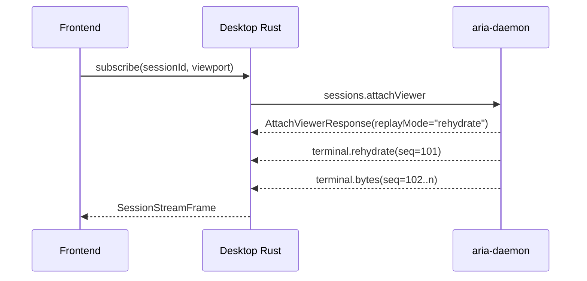

# Aria Terminal Session Stream Protocol Spec v0.2

- 状态：Draft
- 日期：2026-04-03
- 所属阶段：Phase 2
- 关联文档：`docs/specs/terminal-platform-spec.md`
- 目标读者：`aria-daemon`、`aria-desktop`、终端渲染器、后续 AI API 实现者

## 1. 背景

Phase 1 已经完成以下能力：

1. `LocalPtyTransport` 已可创建本地 shell。
2. `SessionManager` 已能创建、列举、写入、resize、关闭 session。
3. `aria-terminal` 已能基于 `vt100` 维护当前屏幕状态并生成 snapshot。
4. `aria-ipc` 已有基础 RPC 契约，桌面端可以通过 `getSessionSnapshot` 查看当前屏幕。

Phase 1 的问题也很明确：

1. 前端目前只能反复请求 snapshot，steady-state 成本很高。
2. “前端视图”和“后端 session”之间还没有 attach 语义。
3. 后端虽然已经能生成 snapshot，但还没有形成可恢复、可 replay、可供 AI 消费的权威终端状态模型。
4. 当前 draft 曾尝试把 steady-state 增量定义为结构化行级 delta，但对于全屏 TUI 应用，这类协议会把终端本来已经压缩得很好的字节流重新展开，导致刷新压力重新回到协议层。

本次修订的结论是：

1. 后端仍然必须维护权威终端状态。
2. attach 时必须支持“从当前状态恢复”。
3. 但 steady-state 热路径不再发送行级 diff，而是尽量直接发送原生 PTY 字节流。
4. 因此，Phase 2 采用 hybrid 协议：`attach/resync 使用 rehydrate VT payload`，`steady-state 使用 raw PTY bytes`，`少量控制信息仍走结构化事件`。

## 2. 目标与非目标

### 2.1 目标

1. 前端不再轮询 `sessions.getSnapshot`，而是通过长连接 attach 到 session。
2. 新 viewer attach 时能一次拿到可渲染的初始状态。
3. steady-state 输出尽量直接复用 PTY 原生字节流，避免行级 diff 对 TUI 造成放大。
4. scrollback、当前 screen、primary/alternate buffer、terminal modes 仍由后端记录并持有权威状态。
5. session 在没有任何前端附着时仍持续运行，稍后 attach 也能恢复到当前状态。
6. 协议同时服务于桌面前端和未来 localhost AI 客户端，逻辑消息模型保持一致。
7. 支持断线重连后的 bytes replay；补发失败时能安全回退到一次 rehydrate。

### 2.2 非目标

1. Phase 2 不解决 SSH、插件、录制回放。
2. Phase 2 不做磁盘级终端持久化；本 spec 只要求后端内存中的权威状态和有限 replay 窗口。
3. Phase 2 不解决多个交互式 viewer 争抢 resize 的完整仲裁问题。
4. Phase 2 不要求 AI 直接消费 steady-state 原生字节流；后续 AI API 仍应主要从后端权威状态派生。
5. Phase 2 不要求实现“任意第三方终端库内部 buffer 的直接注入”；attach 恢复必须通过标准化 rehydrate 过程完成。

## 3. 当前实现现状与缺口

### 3.1 已有实现

| 模块 | 当前能力 |
| --- | --- |
| `crates/aria-session` | session actor、local PTY、snapshot、基础 scrollback 计数 |
| `crates/aria-terminal` | 基于 `vt100` 的当前屏幕状态解析 |
| `crates/aria-ipc` | 基础请求/响应 RPC 契约 |
| `apps/aria-daemon` | 单实例 daemon、按请求生成 snapshot |
| `apps/aria-desktop` | 用 Tauri `invoke` 调 daemon，并以 snapshot 做调试展示 |

### 3.2 明确缺口

1. 没有实时订阅流。
2. 没有 `attachViewer` / `detachViewer` 协议。
3. 没有“后端权威 terminal state”抽象。
4. 没有“事件序号 + byte replay log”模型，因此无法断线续传。
5. 没有 attach 时的 rehydrate 机制。
6. 没有 scrollback 切片读取 API。

## 4. 方案比较

### 方案 A：继续使用 snapshot 轮询

优点：

1. 基于现有实现改动最小。

缺点：

1. 每次都要重新序列化整屏内容，steady-state 成本最高。
2. 无法表达 attach 生命周期、断线续传、增量同步。
3. 很难自然扩展到 AI 观察者。

结论：不采用。

### 方案 B：后端维护权威状态，steady-state 发送结构化行级 delta

优点：

1. 新 viewer attach 可以直接获得当前状态。
2. 后端状态边界清晰，天然支持 AI。

缺点：

1. 对普通 shell 尚可，但对 `vim`、`less`、`htop` 这类 TUI，全屏刷新会导致协议层频繁展开大量脏行。
2. 前端不得不依赖 Aria 自己定义的 render diff，而不是尽量复用成熟终端库的原生字节输入路径。

结论：不作为 Phase 2 主方案。

### 方案 C：只转发原始 VT 字节流，前端自己从零恢复全部状态

优点：

1. steady-state 最轻。
2. 最贴近真实终端。

缺点：

1. 新 viewer attach 时无法直接恢复到当前状态，必须回放足够长的历史字节。
2. AI 和其他后端消费者仍然缺少权威状态源。
3. 一旦 replay 窗口不够，attach 就会失败或退化得不可控。

结论：不采用。

### 方案 D：后端维护权威状态，attach/resync 发送 rehydrate VT payload，steady-state 发送 raw PTY bytes

优点：

1. attach 时可以从后端当前状态恢复。
2. steady-state 热路径仍然复用终端原生字节流，对 TUI 最友好。
3. 前端更容易接入现成终端库。
4. AI 和未来自动化接口仍然可以建立在后端权威状态上。

缺点：

1. daemon 需要新增 rehydrate encoder 和 byte replay log。
2. terminal engine 需要保存更多模式状态，以便 rehydrate 后能继续正确消费后续原生字节。

结论：采用方案 D。

## 5. 总体设计

### 5.1 设计原则

1. `Session` 是运行中的终端实例。
2. `Viewer` 是一个附着到 `Session` 的观察者；它不是 session 本体。
3. 后端保存 session 的权威状态；前端缓存是可丢弃的派生状态。
4. steady-state 热路径以“原生 PTY 字节流”为边界，而不是以行级 diff 为边界。
5. attach、resync、AI 查询则以“后端权威 terminal state”为边界。
6. 所有流式事件都必须带单调递增的 `seq`。
7. 当 replay 无法继续应用时，允许回退到一次完整 rehydrate。

### 5.2 控制面与实时面

| 平面 | 职责 | 典型方法 |
| --- | --- | --- |
| 控制面 | 创建 session、写入输入、resize、关闭、查询 metadata | `sessions.createLocal`、`sessions.write`、`sessions.resize`、`sessions.close` |
| 实时面 | attach viewer、初始恢复、bytes 推送、断线 replay、viewer ack | `sessions.attachViewer`、`sessions.detachViewer`、`sessions.viewerAck`、事件流 |
| 历史读取面 | scrollback 分页、AI 读取结构化状态 | `sessions.readScrollback`、后续 `ai.*` API |

Phase 2 不移除现有控制面 RPC，但禁止前端 renderer 继续依赖 `sessions.getSnapshot` 做 steady-state 刷新。

## 6. 连接与承载协议

### 6.1 规范层与承载层分离

本 spec 定义的是逻辑消息协议，不把某个具体 transport 写死在业务语义里。

统一逻辑协议名称：`Session Stream Protocol`

### 6.2 三段承载关系

1. Web 前端 -> `aria-desktop` Rust shell
   前端通过 Tauri channel 订阅 `SessionStreamFrame`。
2. `aria-desktop` Rust shell -> `aria-daemon`
   使用一条持久化本地 IPC 流承载同样的 `SessionStreamFrame`。
3. 外部 AI / localhost client -> `aria-daemon`
   使用 WebSocket 承载同样的逻辑消息。

### 6.3 二进制与 JSON 承载

逻辑协议允许两种物理承载形式：

1. 二进制承载
   `terminal.bytes` 和 `terminal.rehydrate` 的 payload 直接作为 bytes 传输。
2. JSON 承载
   当 carrier 只能稳定传 JSON 时，bytes payload 以 base64 表示。

约束：

1. 逻辑事件类型必须一致。
2. 不能因为桌面端和 localhost gateway 采用不同 carrier，就分裂成两套协议语义。

## 7. 后端权威状态模型

每个 `SessionActor` 在 Phase 2 必须持有以下状态：

| 状态 | 说明 |
| --- | --- |
| `transport` | PTY/SSH 等字节流来源 |
| `terminal_engine` | 解析 VT 并维护权威 terminal state |
| `primary_buffer` | 主缓冲区当前可见内容 |
| `alternate_buffer` | alternate screen 当前可见内容 |
| `active_buffer` | 当前激活的是 `primary` 还是 `alternate` |
| `scrollback_store` | 主缓冲区历史行存储 |
| `terminal_modes` | 后续原生字节继续消费所需的关键模式状态 |
| `event_seq` | session 级单调递增事件序号 |
| `byte_replay_log` | 最近一段已发送终端字节的可重放日志 |
| `viewers` | 当前附着的 viewer 注册表 |
| `metadata` | title、cwd、shell、status、exit code 等元信息 |

关键要求：

1. `primary_buffer` 和 `alternate_buffer` 都必须在后端保留当前状态。
2. `active_buffer` 和 `terminal_modes` 必须是后端权威状态的一部分。
3. 没有 viewer 时，以上状态仍继续更新。
4. `byte_replay_log` 只服务于短期断线恢复，不替代权威状态本身。

## 8. Viewer 模型

### 8.1 定义

`Viewer` 是对 session 的一次附着实例，通常对应：

1. 一个桌面 pane 的终端视图。
2. 一个只读镜像观察者。
3. 一个未来 AI client 的观察视图。

### 8.2 Phase 2 约束

1. 一个 session 只允许一个 `interactive` viewer 负责 size 驱动。
2. 其他 viewer 以 `observer` 身份附着，只接收状态，不参与 resize 仲裁。
3. 如果未来 Phase 3 支持多 pane 观察同一 session，本协议仍然保留 `viewer_id` 作为扩展点。

### 8.3 Viewer 持有信息

| 字段 | 说明 |
| --- | --- |
| `viewer_id` | 后端生成的 viewer 标识 |
| `session_id` | 绑定的 session |
| `role` | `interactive` 或 `observer` |
| `viewport` | cols/rows/pixelWidth/pixelHeight |
| `last_ack_seq` | 客户端已确认应用到的最大事件序号 |
| `attached_at` | attach 时间 |

## 9. 协议对象

### 9.1 基础枚举

```ts
type BufferKind = "primary" | "alternate";
type ViewerRole = "interactive" | "observer";
type RehydrateReason = "attach" | "resize" | "replay-gap" | "server-resync";
```

### 9.2 流式事件联合类型

```ts
type SessionStreamFrame =
  | TerminalRehydrateFrame
  | TerminalBytesFrame
  | SessionMetadataFrame
  | ViewerDetachedFrame;
```

说明：

1. steady-state 不再有 `buffer.delta`。
2. 渲染热路径的主要事件只剩 `terminal.bytes`。
3. `terminal.rehydrate` 是“重建当前状态”的控制型内容事件。

## 10. 实时协议

### 10.1 请求：`sessions.attachViewer`

```ts
interface AttachViewerRequest {
  sessionId: string;
  role: ViewerRole;
  viewport: {
    cols: number;
    rows: number;
    pixelWidth: number;
    pixelHeight: number;
  };
  replayFromSeq?: number;
  rehydrateScrollbackLines?: number;
}

interface AttachViewerResponse {
  viewerId: string;
  sessionId: string;
  acceptedRole: ViewerRole;
  replayMode: "bytes" | "rehydrate";
  nextExpectedSeq: number;
}
```

语义：

1. `replayFromSeq` 为空时，表示全新 attach。
2. `replayFromSeq` 存在且 `byte_replay_log` 覆盖该区间时，daemon 可以选择直接补发缺失的 `terminal.bytes`。
3. 如果 replay 窗口不够，或者后端判断当前状态必须整体重建，则返回 `replayMode = "rehydrate"`，随后发送一条新的 `terminal.rehydrate`。
4. `rehydrateScrollbackLines` 表示 attach 时希望一起恢复多少行最近 scrollback；默认建议 `200`。
5. `nextExpectedSeq` 表示 attach 完成后，客户端应准备接收的第一条服务端事件序号；若随后收到不同序号，客户端必须视为协议断裂并请求 resync。

### 10.2 请求：`sessions.detachViewer`

```ts
interface DetachViewerRequest {
  viewerId: string;
  closeSessionIfUnused?: boolean;
}
```

语义：

1. 正常关闭时显式 detach。
2. 连接断开时后端也必须回收 viewer。
3. `closeSessionIfUnused` 仅用于“关闭终端标签页”场景；daemon 会在 detach 后检查当前 session 是否既没有 attached viewer，也没有任何 project terminal tab 引用，满足时才关闭 session。

### 10.3 请求：`sessions.viewerAck`

```ts
interface ViewerAckRequest {
  viewerId: string;
  seq: number;
}
```

语义：

1. 客户端周期性上报“已应用到哪个事件序号”。
2. daemon 用它做 lag 观测、调试和 replay 清理判断。
3. ack 不是强一致提交机制；客户端重连仍以自己保存的 `replayFromSeq` 为准。

### 10.4 请求：`sessions.readScrollback`

```ts
interface ReadScrollbackRequest {
  sessionId: string;
  beforeLineId?: number;
  limit: number;
}

interface ReadScrollbackResponse {
  sessionId: string;
  firstAvailableLineId: number | null;
  lastAvailableLineId: number | null;
  hasMoreAbove: boolean;
  lines: Array<{
    lineId: number;
    text: string;
  }>;
}
```

语义：

1. 该 API 不属于 renderer steady-state 热路径。
2. 它主要服务于更深的 scrollback 浏览、调试能力和未来 AI 消费。
3. `beforeLineId` 为空时，返回当前可获得的最新 `limit` 行。
4. `beforeLineId` 存在时，返回严格早于该行 ID 的最多 `limit` 行。

## 11. 推送事件

所有事件都带 `seq`，并且按单个 session 内严格递增。

### 11.1 事件：`terminal.rehydrate`

```ts
interface TerminalRehydrateFrame {
  type: "terminal.rehydrate";
  seq: number;
  sessionId: string;
  viewerId: string;
  reason: RehydrateReason;
  activeBuffer: BufferKind;
  size: {
    cols: number;
    rows: number;
    pixelWidth: number;
    pixelHeight: number;
  };
  payloadEncoding: "binary" | "base64";
  vtPayload: Uint8Array | string;
  metadata: {
    title: string;
    status: string;
    cwd: string | null;
    shell: string;
    processId: number | null;
    exitCode: number | null;
  };
}
```

语义：

1. `vtPayload` 是一段由 daemon 生成的 synthetic VT byte stream。
2. 这段 payload 必须是自包含的：把它喂给一个全新、空状态的 terminal parser 后，应能恢复到当前 session 的可见状态。
3. 若 `activeBuffer = "primary"`，daemon 可以把最近 `rehydrateScrollbackLines` 行一并编码进 payload，用于恢复有限 scrollback tail。
4. 若 `activeBuffer = "alternate"`，payload 只需要恢复 alternate screen 的当前状态，不需要额外编码主缓冲区 scrollback。
5. `vtPayload` 必须包含继续消费后续原生字节所需的关键模式设置，而不只是把可见字符画出来。

触发条件：

1. 新 viewer attach。
2. replay gap 导致无法只靠 bytes 恢复。
3. session resize 后需要整体重建。
4. daemon 主动要求 resync。

客户端处理规则：

1. 丢弃本地 terminal parser 状态。
2. 重新创建或 reset 本地终端实例。
3. 将 `vtPayload` 作为初始化输入喂入终端库。
4. 记录当前 `seq` 作为新的同步基线。

### 11.2 事件：`terminal.bytes`

```ts
interface TerminalBytesFrame {
  type: "terminal.bytes";
  seq: number;
  sessionId: string;
  viewerId: string;
  payloadEncoding: "binary" | "base64";
  bytes: Uint8Array | string;
}
```

语义：

1. `bytes` 是 daemon 从 PTY 读取并转发的原生输出字节。
2. 这是 steady-state 唯一的内容增量事件。
3. 客户端不应把它解释成“行变化”，而应直接交给终端库解析。
4. daemon 可以在极短 flush 窗口内合并多个 PTY 读块，但不得改变字节顺序。

### 11.3 事件：`session.metadata`

```ts
interface SessionMetadataFrame {
  type: "session.metadata";
  seq: number;
  sessionId: string;
  viewerId: string;
  metadata: {
    title?: string;
    status?: string;
    cwd?: string | null;
    shell?: string;
    processId?: number | null;
    exitCode?: number | null;
  };
}
```

语义：

1. 用于 title、status、cwd、exit code 等变化。
2. `ProcessExit` 至少必须产出一条 `session.metadata` 事件。

### 11.4 事件：`viewer.detached`

```ts
interface ViewerDetachedFrame {
  type: "viewer.detached";
  seq: number;
  sessionId: string;
  viewerId: string;
  reason: "client-request" | "connection-closed" | "session-closed" | "server-shutdown";
}
```

## 12. 同步流程

### 12.1 正常 attach



规则：

1. attach 成功后，第一条内容事件通常是 `terminal.rehydrate`。
2. renderer 只有在收到并应用 `terminal.rehydrate` 后才能开始安全消费 steady-state 字节流。

### 12.2 断线重连

1. 客户端保存最后一个已应用的 `seq`。
2. 重连时将其作为 `replayFromSeq` 传回。
3. 如果后端 `byte_replay_log` 仍覆盖该区间，则先补发缺失的 `terminal.bytes`，再进入 steady-state。
4. 如果不覆盖，则发送一条 `terminal.rehydrate(reason = "replay-gap")`。

### 12.3 resize

1. `interactive` viewer 变更 viewport 后，由控制面触发 `sessions.resize`。
2. daemon 更新 PTY size 与权威 terminal state。
3. Phase 2 规定：resize 后允许直接发送一次 `terminal.rehydrate(reason = "resize")`，以避免客户端和服务端 parser 状态漂移。

## 13. 增量推送策略

### 13.1 steady-state

steady-state 下，daemon 的输出策略是：

1. 先把 PTY 输出立即应用到后端权威 terminal state。
2. 同时把原始字节按顺序送入 `byte_replay_log`。
3. 在 8ms 到 16ms 的 flush 周期内合并连续字节块。
4. 每次 flush 最多产出一条 `terminal.bytes`。

这样可以避免 shell 高频输出时产生过多小包，同时保留 TUI 原生字节流的优势。

### 13.2 为什么不用行级 delta

对于 TUI 应用，终端本身已经通过控制序列表达“光标移动、局部擦除、模式切换、屏幕切换”。如果把这些再次展开为行级 diff，会有两个问题：

1. 终端应用在协议层被迫“重新膨胀”。
2. 前端无法直接复用成熟终端库的字节入口。

因此，Phase 2 明确规定：render hot path 以原生字节流为准。

## 14. 前端实现约束

前端 renderer 必须遵循以下规则：

1. attach 或 resync 时，先 reset 本地终端实例，再应用 `terminal.rehydrate`。
2. steady-state 时，只把 `terminal.bytes` 交给终端库，不自行做行级 diff。
3. 若收到新的 `terminal.rehydrate`，必须视为强制重建点。
4. 若发现事件序号断裂，必须请求 resync，而不是继续猜测本地状态。

这意味着 Phase 2 的 renderer 适合建立在“能从空状态持续喂入 VT bytes”的第三方终端库之上，而不是建立在 Aria 自己维护的行级前端 buffer 上。

## 15. Scrollback 策略

Phase 2 将 scrollback 分成两层：

1. attach warm state
   通过 `terminal.rehydrate` 可恢复一段有限的最近 scrollback tail。
2. 深历史读取
   通过 `sessions.readScrollback` 按页读取，不进入 steady-state 热路径。

约束：

1. scrollback 的权威存储始终在后端。
2. 前端本地终端库里的 scrollback 只是一段可丢弃缓存，不是权威数据源。
3. 更深历史不要求通过 replay 全量原生字节来恢复。

## 16. AI 兼容性约束

虽然 Phase 2 首个消费者是 renderer，但协议必须为 AI 保留正确边界：

1. AI 读取的不是前端缓存，而是 daemon 维护的权威 terminal state。
2. 未来 `ai.getStructuredSnapshot`、`ai.readBlocks` 等 API 必须从同一份 `primary_buffer + alternate_buffer + scrollback_store + terminal_modes + metadata` 派生。
3. 不能让 AI 依赖“前端是否在线”才能获取终端状态。
4. 不能要求 AI 自己重放 steady-state 原生字节，才能理解当前终端状态。

## 17. 对当前代码结构的影响

Phase 2 需要的后端边界变化如下：

1. `aria-session`
   从“只支持 snapshot”升级为“维护 terminal state + byte replay log + viewers + attach/resync 流程”。
2. `aria-terminal`
   从“可导出 snapshot”升级为“可导出 snapshot，同时可生成 rehydrate VT payload，并暴露关键模式状态”。
3. `aria-ipc`
   增加 viewer attach/readScrollback/ack 等契约，以及 `SessionStreamFrame` 类型。
4. `aria-daemon`
   增加持久流式连接处理，而不只是单次 request/response。
5. `aria-desktop`
   前端不再周期性 `invoke(get_session_snapshot)`；改为订阅 `terminal.rehydrate + terminal.bytes + session.metadata` 流。

## 18. 验收标准

实现完成后，应满足以下行为：

1. 创建一个本地 shell 后，前端 attach 可以在一次 attach 流程内拿到可渲染首屏，而不是反复轮询 snapshot。
2. steady-state 输出时，前端收到的主要内容增量是 `terminal.bytes`，而不是整屏 snapshot 或行级 diff。
3. 执行 `vim` / `less` / `htop` 这类 TUI 时，不会因为协议层展开行级脏区而造成额外放大。
4. 关闭前端后 session 仍继续运行；稍后重新 attach 仍能拿到当前状态。
5. 在 `byte_replay_log` 保留窗口内断线重连时，可以只补缺失 bytes；超出窗口时自动回退到 `terminal.rehydrate`。
6. 未来 AI API 可以复用同一份后端状态，而不依赖前端缓存。

## 19. 本 spec 的结论

Phase 2 不应围绕 snapshot 轮询，也不应把 steady-state 设计成结构化行级 delta，而应先建立：

1. 后端权威 terminal state。
2. viewer attach/detach 生命周期。
3. `terminal.rehydrate + terminal.bytes + session.metadata` 的实时协议。
4. 基于 `seq` 的 byte replay / resync 机制。

只有先把这条协议稳定下来，后续 renderer、AI、layout、多 viewer 观察同一 session 才会建立在同一个可靠边界上。
